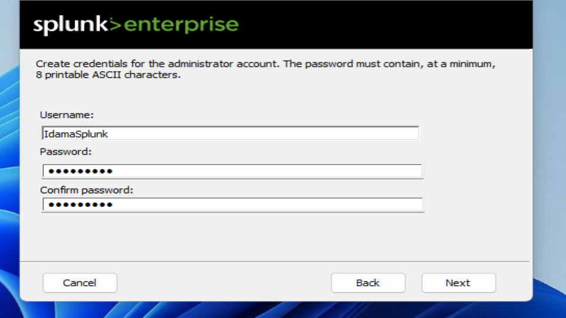
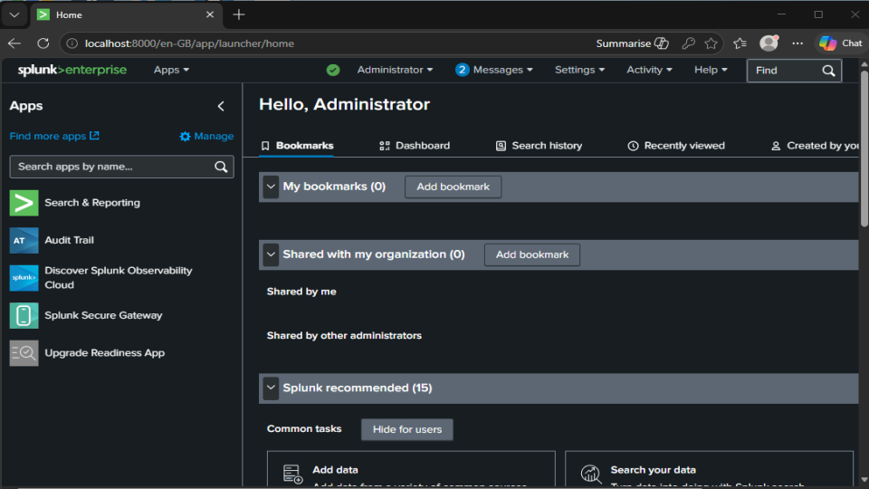
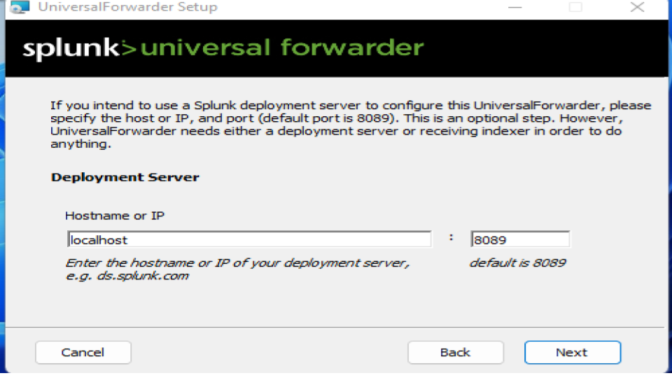
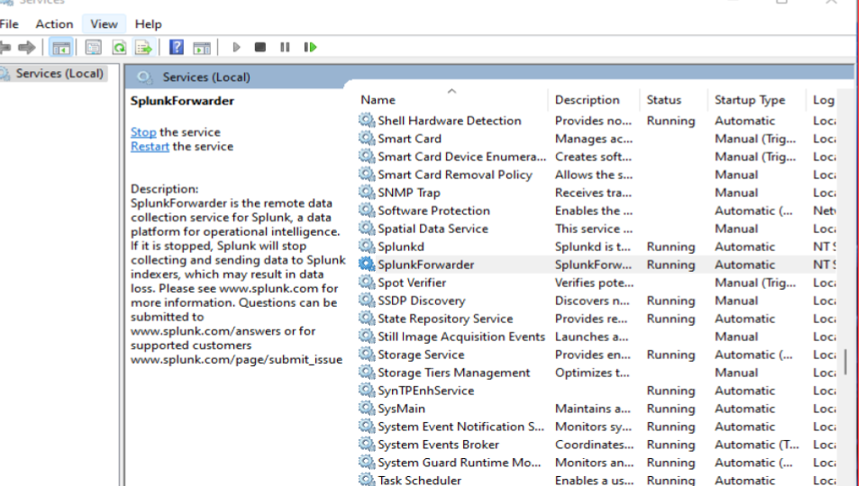
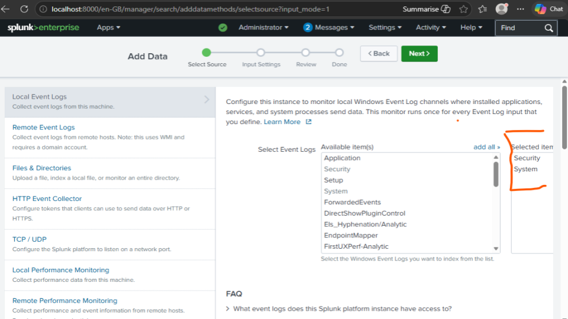
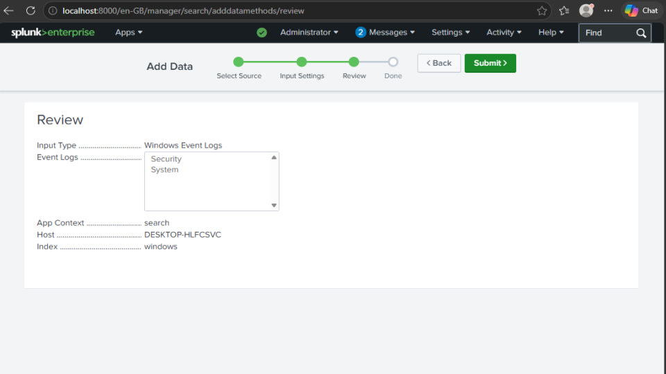
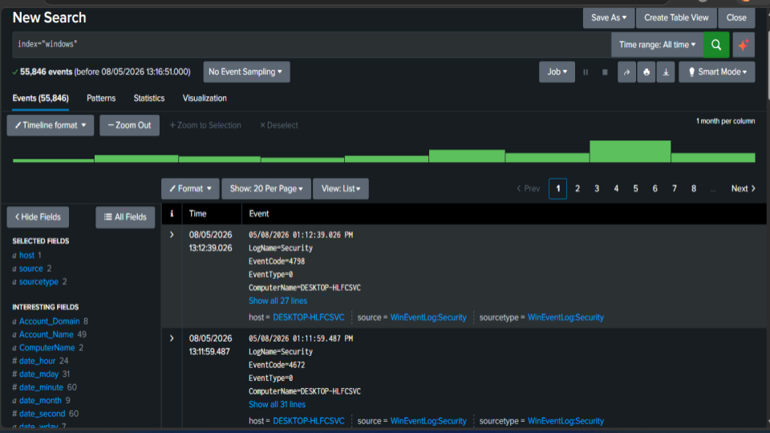

# 🛡️ Windows Event Monitoring with Splunk SIEM

## 📌 Project Overview
This project demonstrates the implementation of a basic Security Information and Event Management (SIEM) environment using Splunk Enterprise for Windows Event Log monitoring.

The lab focuses on configuring Splunk Enterprise, installing the Splunk Universal Forwarder, ingesting Windows Security and System logs, and performing log analysis through Splunk search queries.

The goal of this project was to simulate how SOC analysts monitor endpoint activity, collect logs, and investigate security-related events within a centralized SIEM platform.

---

# 🎯 Objectives
- Install and configure Splunk Enterprise
- Configure the Splunk Universal Forwarder
- Ingest Windows Event Logs into Splunk
- Monitor Security and System event logs
- Perform log analysis using Splunk queries
- Validate successful event ingestion and SIEM visibility

---

# 🧰 Tools & Technologies Used
- Splunk Enterprise
- Splunk Universal Forwarder
- Windows 11
- Windows Event Viewer
- SIEM Monitoring

---

# 🏗️ Lab Environment

| Component | Description |
|---|---|
| Operating System | Windows 11 |
| SIEM Platform | Splunk Enterprise |
| Log Source | Windows Event Logs |
| Data Collection | Splunk Universal Forwarder |
| Monitored Logs | Security & System Logs |

---
# 📚 Skills Demonstrated
- SIEM Configuration
- Windows Event Log Monitoring
- Splunk Enterprise Administration
- Log Ingestion & Analysis
- Security Event Investigation
- SOC Monitoring Concepts
- Event Correlation Basics

### 📊 Evidence 

<h3 align="center">In this step, I installed Splunk Enterprise on the Windows machine to begin configuring the SIEM environment</h3>

    

<h3 align="center">After successfully installing Splunk Enterprise, I accessed the Splunk web interface through the localhost web portal.</h3>

    

<h3 align="center">In this step, I configured the Splunk Universal Forwarder to communicate with the Splunk server</h3>

    

<h3 align="center">After installing the Splunk Universal Forwarder, I verified that the SplunkForwarder service was running successfully within Windows Services</h3>

    

<h3 align="center">At this stage, I began configuring data ingestion in Splunk Enterprise.</h3>

    

<h3 align="center">In this step, I selected the Windows Event Log data source from the available input options in Splunk</h3>

    

<h3 align="center">Here, I selected the Security and System event log channels for monitoring and ingestion into Splunk.</h3>

    

<h3 align="center">Before finalizing the configuration, I reviewed the selected event log settings to ensure the correct log sources and index configuration were applied.</h3>

    

<h3 align="center">After completing the configuration process, Windows Event Logs were successfully ingested into Splunk Enterprise.</h3>

    

All screenshots are here:

🔗 [Google Slides ](https://docs.google.com/presentation/d/1dA2qaCVj_mEvSgb1v2BjULstgeQHIxDoC130sKnJhPk/edit?usp=sharing)

## Investigation Summary

After configuring log ingestion in Splunk Enterprise, Windows Security Event Logs were successfully collected and indexed within the SIEM environment.

A search query was performed using:
index="windows"

The results displayed multiple Windows Security Event Logs generated from the local system.

## Findings
- Security logs were successfully ingested into Splunk Enterprise.
- The SIEM platform correctly indexed Windows Event Logs from the monitored host.
- Observed events were identified as normal system and account-related activities generated by the local Windows machine.
- No indicators of compromise, unauthorized access, or suspicious behavior were identified during the investigation.

## Conclusion
The observed events were classified as benign activity because the logs originated from legitimate operations performed within the local lab environment. This confirmed that the SIEM configuration and event collection process were functioning successfully.
